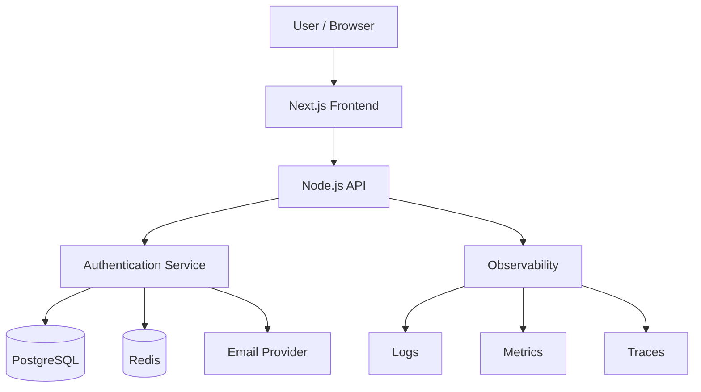
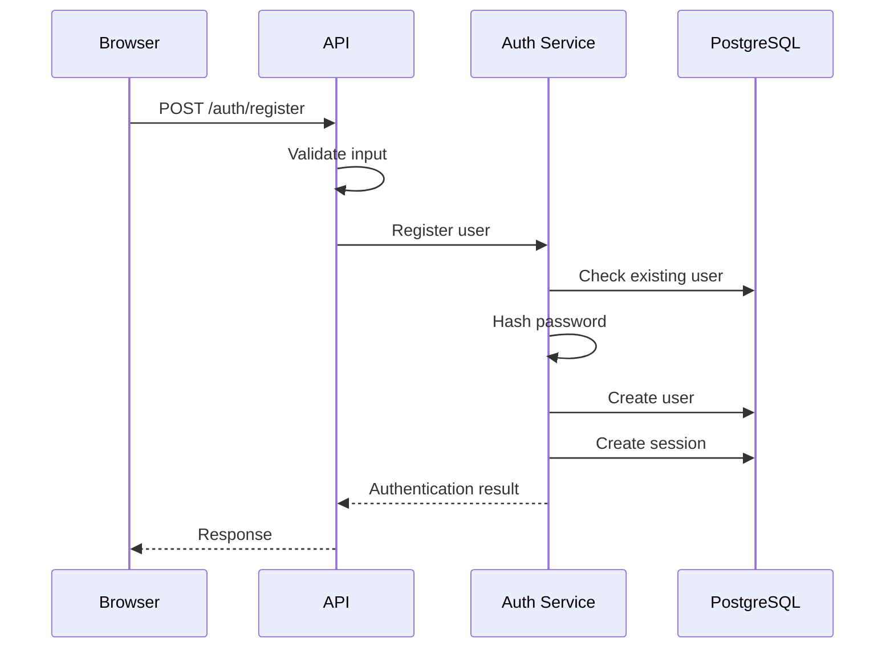
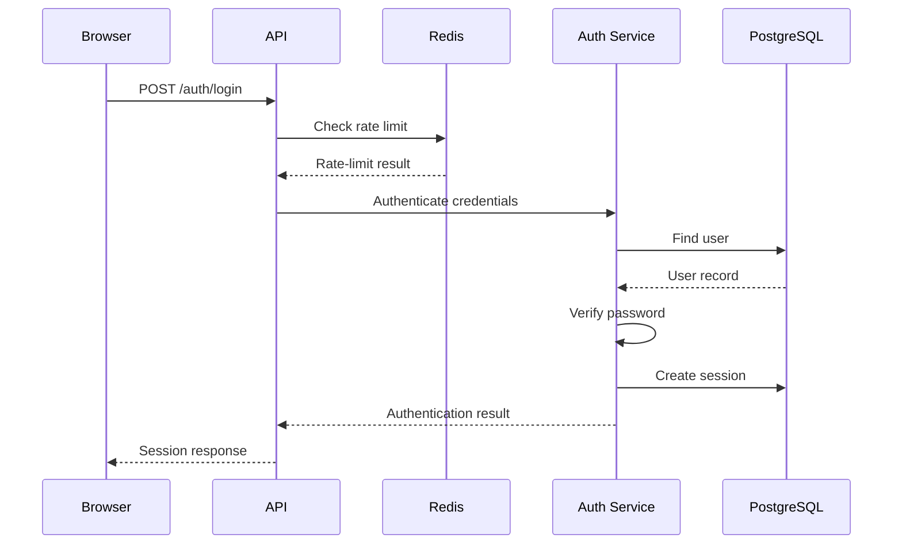

# Authentication — Architecture

## 1. Architecture Goal

The authentication system provides secure identity management while remaining testable, observable, maintainable, and horizontally scalable.

The architecture separates:

- Frontend
- API
- Authentication logic
- Database
- Rate limiting
- External services

---

## 2. High-Level Architecture



---

## 3. Component Responsibilities

### Frontend

Responsible for:

- Rendering authentication interfaces
- Collecting user input
- Client-side validation
- Displaying authentication state
- Handling user-facing errors

The frontend must not be trusted with security decisions.

### API

Responsible for:

- HTTP request handling
- Input validation
- Authentication endpoints
- Authorization checks
- Rate-limit enforcement
- Response formatting
- Error handling

### Authentication Service

Responsible for:

- Registration
- Credential verification
- Password hashing
- Session creation
- Session validation
- Session revocation
- Password reset
- Authentication events

Authentication logic should remain isolated from unrelated business logic.

### PostgreSQL

PostgreSQL is the durable source of truth for:

- Users
- Sessions
- Password reset records
- Roles
- Security-sensitive account state
- Audit records

### Redis

Redis is used for:

- Rate limiting
- Temporary counters
- Short-lived authentication state
- Optional caching

Redis is not the authoritative source of user identity.

### Email Provider

Used for:

- Password reset delivery
- Security notifications
- Account-related communication

Email delivery is an external dependency.

---

## 4. Authentication Flow

### Registration



### Login



---

## 5. Authentication vs Authorization

### Authentication

Answers:

> Who is this user?

Example:

```text
Session → User ID
```

### Authorization

Answers:

> What is this user allowed to do?

Example:

```text
User → Role → Permission → Resource
```

Authorization must always be enforced on the server.

Hiding a button in the frontend is not authorization.

---

## 6. Session Strategy

The reference implementation uses server-recognized sessions.

```text
Browser
   │
   │ Session Cookie
   ▼
API
   │
   │ Session Lookup
   ▼
PostgreSQL
```

Session credentials must use appropriate cookie security controls.

Production traffic must use HTTPS.

---

## 7. Trust Boundaries

```text
┌──────────────────────────┐
│        Browser           │
│      UNTRUSTED INPUT     │
└────────────┬─────────────┘
             │
             ▼
┌──────────────────────────┐
│           API            │
│    VALIDATION BOUNDARY   │
└────────────┬─────────────┘
             │
             ▼
┌──────────────────────────┐
│   Authentication Layer   │
│    SECURITY BOUNDARY     │
└────────────┬─────────────┘
             │
       ┌─────┴─────┐
       ▼           ▼
 PostgreSQL      Redis
  TRUSTED      SUPPORTING
  STORAGE       SERVICE
```

Every trust boundary must validate assumptions from the previous layer.

---

## 8. Security Boundaries

Sensitive operations include:

- Password verification
- Session creation
- Session validation
- Session revocation
- Password reset
- Role checks

These operations remain server-side.

The client must never be trusted to provide:

- User ID
- Role
- Permissions
- Authentication success
- Authorization decisions

---

## 9. Failure Handling

### PostgreSQL Unavailable

The API should:

- Return a controlled error
- Avoid exposing database details
- Log the failure
- Record a metric
- Trigger operational alerting

### Redis Unavailable

The system must have an explicit policy for rate limiting.

The chosen behavior must be documented and tested.

### Email Provider Unavailable

The system should:

- Record the failure
- Return a safe user-facing response
- Retry where appropriate
- Avoid duplicate reset operations

---

## 10. Horizontal Scaling

Application instances should not depend on local memory for durable authentication state.

```text
                 Load Balancer
                      │
          ┌───────────┼───────────┐
          ▼           ▼           ▼
       API-01       API-02      API-03
          │           │           │
          └───────────┼───────────┘
                      │
              ┌───────┴────────┐
              ▼                ▼
         PostgreSQL          Redis
```

This allows additional API instances to be added without moving authentication state between servers.

---

## 11. Architecture Principles

### Server-side security

Security-sensitive decisions belong on trusted server infrastructure.

### Database as source of truth

Durable identity and authorization state must have a clear authoritative store.

### Explicit failure behavior

Every external dependency must have documented failure behavior.

### Observable security

Security-sensitive operations should produce useful telemetry without recording secrets.

### Evidence over assumptions

Architecture claims should eventually be supported by tests, measurements, or operational evidence.

---

## 12. Key Trade-offs

### Server-side Sessions vs Tokens

Server-side sessions provide straightforward revocation and centralized control but require server-side session state.

Self-contained tokens can reduce lookup requirements but introduce additional complexity around revocation, rotation, expiration, and key management.

SHIPSTACK uses server-recognized sessions for this reference implementation.

### PostgreSQL vs NoSQL

PostgreSQL provides:

- Strong transactional guarantees
- Relational integrity
- Constraints
- Mature indexing

A different database may be appropriate for a different product.

The decision should be based on requirements rather than popularity.

### Redis Dependency

Redis can improve high-frequency temporary operations but introduces another operational dependency.

Therefore we must define:

- Failure behavior
- Monitoring
- Capacity expectations
- Recovery behavior

---

## 13. Architecture Decisions

Initial decisions:

- Use server-recognized sessions.
- Use PostgreSQL as the durable identity store.
- Use Redis for rate limiting and temporary state.
- Keep authentication logic isolated.
- Keep security decisions server-side.
- Design application instances for horizontal scaling.

---

## 14. Verification

The architecture is not complete until its assumptions can be verified.

Verification should include:

- Authentication integration tests
- Session lifecycle tests
- Authorization tests
- Rate-limit tests
- Failure-injection tests
- Load tests
- Security tests
- Observability validation
