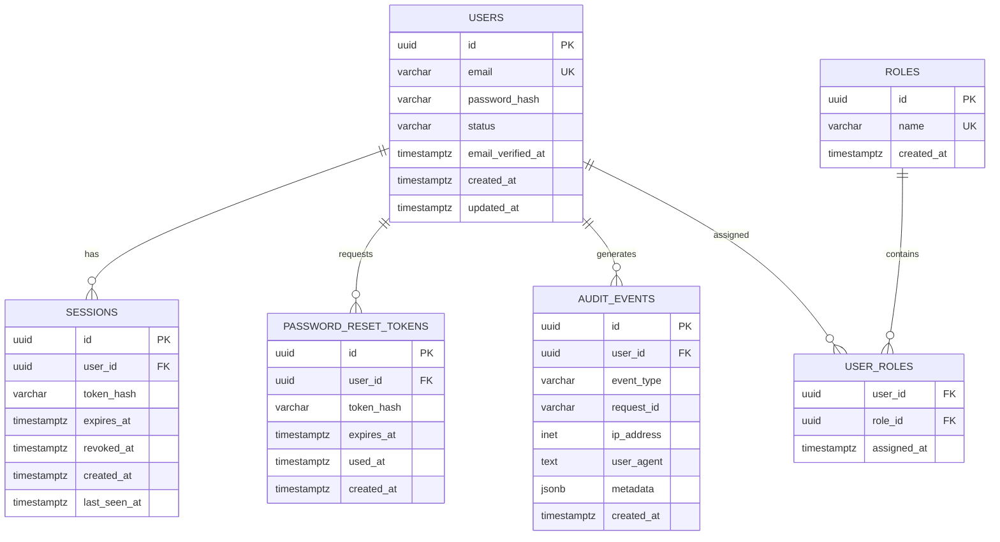

# Authentication — Data Model

## 1. Data Model Goal

The authentication data model stores identity, sessions, recovery state,
authorization state, and security-relevant events.

The design prioritizes:

- Data integrity
- Secure credential storage
- Explicit relationships
- Efficient lookups
- Session lifecycle management
- Auditability
- Safe deletion behavior

---

## 2. Entity Overview



---

## 3. Users

The `users` table represents an identity in the system.

### Fields

| Field | Type | Purpose |
|---|---|---|
| `id` | UUID | Stable primary key |
| `email` | VARCHAR | Login identifier |
| `password_hash` | VARCHAR | Password hash |
| `status` | VARCHAR | Account lifecycle state |
| `email_verified_at` | TIMESTAMPTZ | Verification timestamp |
| `created_at` | TIMESTAMPTZ | Creation time |
| `updated_at` | TIMESTAMPTZ | Last update time |

### Constraints

- `id` is the primary key.
- `email` must be unique.
- `email` must be normalized consistently.
- `password_hash` must never contain a plaintext password.
- `status` should only allow documented values.

Example status values:

```text
active
disabled
locked
pending
```

The exact state machine should be documented before implementation.

---

## 4. Sessions

A session represents an authenticated browser context.

### Fields

| Field | Type | Purpose |
|---|---|---|
| `id` | UUID | Session identifier |
| `user_id` | UUID | Owning user |
| `token_hash` | VARCHAR | Hash of the session secret |
| `expires_at` | TIMESTAMPTZ | Session expiration |
| `revoked_at` | TIMESTAMPTZ | Explicit revocation time |
| `created_at` | TIMESTAMPTZ | Session creation |
| `last_seen_at` | TIMESTAMPTZ | Recent activity |

### Security Principle

The raw session secret should not be stored in the database.

Conceptually:

```text
Browser
   |
   | raw session secret
   v
API
   |
   | hash(session secret)
   v
PostgreSQL
```

If the database is exposed, storing only a hash reduces the value of the
stored session material.

### Session Validity

A session is valid only when:

```text
user exists
AND
user is allowed to authenticate
AND
session is not revoked
AND
session has not expired
```

---

## 5. Password Reset Tokens

Password reset credentials are short-lived recovery mechanisms.

### Fields

| Field | Type | Purpose |
|---|---|---|
| `id` | UUID | Record identifier |
| `user_id` | UUID | Target user |
| `token_hash` | VARCHAR | Hash of reset secret |
| `expires_at` | TIMESTAMPTZ | Expiration |
| `used_at` | TIMESTAMPTZ | Consumption time |
| `created_at` | TIMESTAMPTZ | Creation time |

### Security Rules

- Store only a hash of the reset secret.
- Make reset credentials short-lived.
- Make each credential single-use.
- Mark the credential as consumed after successful use.
- Do not log reset secrets.
- Avoid exposing whether an email belongs to an account.

---

## 6. Roles

Roles represent coarse-grained authorization groups.

Example roles:

```text
user
admin
```

The initial implementation should avoid creating dozens of roles without a
real authorization requirement.

Roles should represent meaningful differences in permissions.

---

## 7. User Roles

`user_roles` represents the relationship between users and roles.

This allows a user to have one or more roles without embedding authorization
logic directly inside the user record.

### Constraints

A composite unique constraint should prevent the same role from being
assigned to the same user multiple times.

Conceptually:

```text
(user_id, role_id) UNIQUE
```

---

## 8. Audit Events

Audit events record security-relevant activity.

Examples:

```text
auth.register.success
auth.login.success
auth.login.failure
auth.logout
auth.password_reset.requested
auth.password_reset.completed
auth.session.revoked
auth.password.changed
auth.role.changed
```

### Important Rule

Audit records must not contain:

- Passwords
- Password hashes
- Session secrets
- Reset tokens
- Access tokens
- Authorization headers
- Other sensitive credentials

### Useful Metadata

An event may include:

- User ID
- Request ID
- IP address
- User agent
- Event type
- Timestamp
- Safe contextual metadata

Metadata must be deliberately allowlisted rather than blindly recording
request data.

---

## 9. Relationships

### User → Sessions

One user can have many sessions.

```text
User 1 ─────── N Sessions
```

This supports:

- Multiple devices
- Multiple browsers
- Individual session revocation

### User → Password Reset Tokens

One user may have multiple reset records over time.

Only valid, unexpired, unused credentials can complete recovery.

### User → Roles

Users and roles have a many-to-many relationship.

```text
Users
  N
  |
  |
  N
Roles
```

The join table stores the relationship.

### User → Audit Events

A user can generate many security events.

Some system events may have no user ID, such as an anonymous failed login
attempt.

Therefore `audit_events.user_id` may be nullable when the event represents an
anonymous action.

---

## 10. Index Strategy

Indexes should support real query patterns.

### Users

Recommended:

```text
UNIQUE(email)
```

Primary lookup:

```sql
SELECT *
FROM users
WHERE email = $1;
```

### Sessions

Recommended:

```text
INDEX(user_id)
INDEX(expires_at)
```

The exact index strategy should be validated against production query plans.

### Password Reset Tokens

Recommended:

```text
INDEX(user_id)
INDEX(expires_at)
```

### Audit Events

Recommended:

```text
INDEX(user_id, created_at)
INDEX(event_type, created_at)
INDEX(created_at)
```

Audit data can grow rapidly, so retention must be planned.

---

## 11. Foreign Key Strategy

Relationships should use database-enforced foreign keys.

Example:

```text
sessions.user_id
        ↓
users.id
```

and:

```text
password_reset_tokens.user_id
        ↓
users.id
```

This prevents orphaned authentication records.

---

## 12. Deletion Strategy

Authentication data should not rely on accidental cascading deletes.

Before implementing deletion, define the account lifecycle.

Possible approaches include:

### Soft Disable

```text
users.status = disabled
```

The account remains available for auditing.

### Hard Delete

Remove personal information and dependent records when legally and
operationally appropriate.

### Anonymization

Replace identifying information while retaining required operational records.

The correct strategy depends on the product's legal, business, and retention
requirements.

---

## 13. Transaction Boundaries

Some operations require atomic database changes.

### Registration

Conceptually:

```text
BEGIN
  create user
  create session
  COMMIT
```

If a required step fails, the transaction should not leave a partially
created authentication state.

### Password Reset Completion

Conceptually:

```text
BEGIN
  verify reset credential
  update password
  invalidate relevant sessions
  mark reset credential used
  COMMIT
```

The exact transaction should be validated against the chosen implementation.

---

## 14. Session Revocation

A security-sensitive event may require revoking existing sessions.

Examples:

- Password change
- Password reset
- Account compromise
- Administrator-initiated logout
- Account disablement

The system should define whether revocation means:

```text
revoke current session
```

or:

```text
revoke all sessions
```

The choice should depend on the event.

---

## 15. Data Retention

Authentication data has different retention requirements.

| Data | Example Retention Concern |
|---|---|
| Users | Account lifetime |
| Sessions | Short-lived |
| Reset tokens | Very short-lived |
| Audit events | Longer operational/security retention |
| Rate-limit counters | Short-lived |

Retention policies should be explicit.

Expired temporary records should be cleaned up through a controlled process.

---

## 16. Migration Strategy

Schema changes must be managed through versioned database migrations.

Never rely on manually editing a production database.

A migration should be:

1. Versioned
2. Reviewable
3. Repeatable where appropriate
4. Tested
5. Safe to deploy through the release process

Destructive migrations require additional planning.

---

## 17. Database Security

The application database credentials should use the minimum permissions
required by the application.

Production systems should separate:

- Application credentials
- Migration credentials
- Administrative credentials

Database credentials must be stored through a secure secret-management
mechanism and never committed to Git.

---

## 18. Example SQL Shape

A simplified PostgreSQL schema may eventually resemble:

```sql
CREATE TABLE users (
    id UUID PRIMARY KEY,
    email VARCHAR(320) NOT NULL UNIQUE,
    password_hash VARCHAR(255) NOT NULL,
    status VARCHAR(32) NOT NULL,
    email_verified_at TIMESTAMPTZ,
    created_at TIMESTAMPTZ NOT NULL DEFAULT NOW(),
    updated_at TIMESTAMPTZ NOT NULL DEFAULT NOW()
);

CREATE TABLE sessions (
    id UUID PRIMARY KEY,
    user_id UUID NOT NULL REFERENCES users(id),
    token_hash VARCHAR(255) NOT NULL,
    expires_at TIMESTAMPTZ NOT NULL,
    revoked_at TIMESTAMPTZ,
    created_at TIMESTAMPTZ NOT NULL DEFAULT NOW(),
    last_seen_at TIMESTAMPTZ
);

CREATE INDEX idx_sessions_user_id
    ON sessions(user_id);

CREATE INDEX idx_sessions_expires_at
    ON sessions(expires_at);
```

This is an illustrative schema.

The final implementation must validate data types, constraints, indexes,
migration behavior, and security assumptions.

---

## 19. Verification Checklist

Before considering the data model complete:

- [ ] Users have a stable primary key.
- [ ] Email uniqueness is enforced.
- [ ] Passwords are never stored in plaintext.
- [ ] Session secrets are not stored directly.
- [ ] Session expiration is represented.
- [ ] Sessions can be revoked.
- [ ] Reset credentials expire.
- [ ] Reset credentials are single-use.
- [ ] Roles are explicitly modeled.
- [ ] Foreign keys enforce relationships.
- [ ] Security events are auditable.
- [ ] Secrets are excluded from audit logs.
- [ ] Important queries have appropriate indexes.
- [ ] Data retention is documented.
- [ ] Schema changes use migrations.
- [ ] Database credentials follow least privilege.

---

## 20. Design Principle

The database should enforce the rules that belong to the database.

Application code should not be the only protection for:

- Uniqueness
- Referential integrity
- Required fields
- Valid state transitions where enforceable
- Transactional consistency

The goal is to make invalid authentication state difficult to represent.
